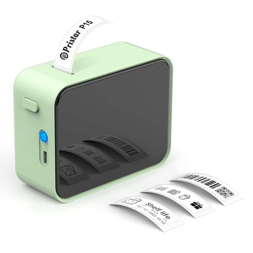
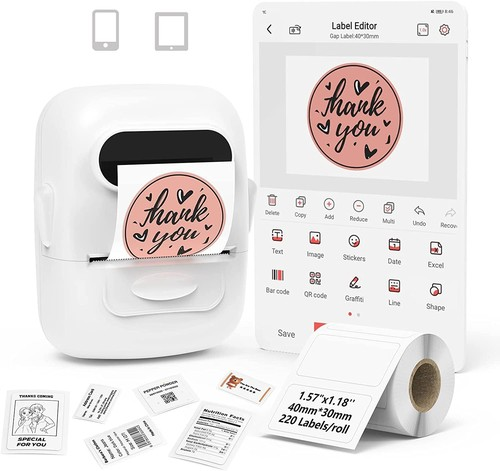

# Pristar / Marklife P15 vs. P12: Comprehensive Comparison

This document details the comparative specifications, hardware design, label printing capabilities, consumable compatibility, and Bluetooth communication protocols for the **Pristar / Marklife P15** and **Pristar / Marklife P12** portable thermal label printers.

  
  

  <em>Left: Pristar / Marklife P15 &nbsp;&nbsp;|&nbsp;&nbsp; Right: Pristar / Marklife P12</em>

---
## 1. Executive Summary & Core Differences

| Feature / Capability | Pristar / Marklife P15 | Pristar / Marklife P12 |
| :--- | :--- | :--- |
| **Primary Form Factor** | Pocket rectangle with rounded corners, side controls, front accent panel | Compact rounded cube / square handheld |
| **Dimensions & Weight** | ~95 × 79 × 40 mm, ~150 g | ~82 × 82 × 61 mm (or 74 × 90 × 35 mm), ~140 g |
| **Print Technology** | Direct Thermal (Inkless) | Direct Thermal (Inkless) |
| **Printhead Resolution** | 203 DPI (8 dots/mm) | 203 DPI (8 dots/mm) |
| **Max Dot Width / Head** | 384 dots (48 mm nominal thermal line) | 384 dots (48 mm nominal thermal line) |
| **Supported Tape Widths**| 12 mm – 15 mm | 12 mm – 15 mm |
| **Tape / Consumables** | Standard D30 / P12 / P15 thermal rolls & gap labels | Standard D30 / P12 / P15 thermal rolls & gap labels |
| **Print Speed** | 20 – 30 mm/s | 20 – 30 mm/s |
| **Battery & Charging** | 1200 mAh Li-ion (USB Type-C) | 1200 mAh Li-ion (USB Type-C) *(Phomemo P12 variant uses 6x AAA)* |
| **Bluetooth Architecture**| **Dual-Mode** (BR/EDR Classic + BLE) | **Standard BLE** (Low Energy) |
| **BLE Protocol** | L11 Binary Protocol (`p112Print`) | L11 Binary Protocol (`p112Print`) |
| **BLE Packet Chunk Size**| 95 bytes per chunk | 90 bytes per chunk |
| **Density Setting Cmd** | Supported (`1F 70 02 <density>`) | Fixed / Default (`10 FF 10 00 <thickness>`) |
| **OS Connection Caveats** | Linux BlueZ defaults to Classic BR/EDR and fails without LE-only override | Connects directly via standard BLE / Web Bluetooth |
| **Official Mobile App** | Marklife (iOS / Android) | Marklife / Print Master (iOS / Android) |

---

## 2. Label Printing Capability & Media Compatibility

### 2.1 Tape Width & Printable Area
Both printers share the same core thermal printing mechanism:
- **Thermal Printhead Width:** 384 dots at 203 DPI (nominal ~48 mm line buffer).
- **Physical Label Width:** Accepts rolls between **12 mm and 15 mm**.
- **Effective Print Width:** 12 mm (~96 dots) to 15 mm (~120 dots) active printable area depending on the tape roll guide margins.

### 2.2 Supported Media Formats
Both models accept identical roll formats and interchangeable consumables:
- **Continuous Tape:** Smooth rolls that can be printed to arbitrary lengths and torn manually with the integrated serrated cutter.
- **Die-Cut / Gap Labels:** Pre-cut rectangular, oval, and circular labels (e.g., 12×30 mm, 12×40 mm, 14×30 mm, 15×40 mm, 15×50 mm) indexed via black marks or gap sensors.
- **Material Varieties:**
  - Standard thermal paper (white, pastel, colored backgrounds).
  - Synthetic waterproof & oil-proof PET film labels.
  - Transparent / translucent thermal film labels.
  - Cable / wire wrap-around tail tags.

---

## 3. Protocol & Communication Details

Both devices utilize the **L11 Binary Protocol** over BLE service `0000ff00-0000-1000-8000-00805f9b34fb`, but exhibit specific low-level differences:

### 3.1 Flow Control & Packet Sizing
- **P15:** Splits print stream into **95-byte** chunks per BLE transmission. Initial credit buffer is 4 credits with credit notifications delivered on characteristic `0xFF03` (`CX`).
- **P12:** Splits print stream into **90-byte** chunks per BLE transmission with the same credit-based flow control mechanism.

### 3.2 Bitmap Formatting
- **Column-Major Encoding:** Both printers require images formatted in column-major byte chunks rather than standard ESC/POS row-major rasters.
- **Header:** `1D 76 30 00 <bytesPerCol_lo> <bytesPerCol_hi> <width_lo> <width_hi>` followed by raw 1-bit pixel columns (LSB = top pixel of each 8-row stripe).

### 3.3 Density & Print Head Control
- **P15:** Supports explicit hardware density configuration via command `1F 70 02 <density>` (levels 1 to 5, default 2 or 3) prior to the print header sequence.
- **P12:** Uses global thickness / burn time command `10 FF 10 00 <thickness>` without the standalone P15 density prefix.

### 3.4 Bluetooth & USB Architecture
- **P15 (Dual-Mode BLE + Classic):**
  - **Bluetooth:** Advertises both Bluetooth Classic (BR/EDR) and BLE.
  - **USB Status (CANNOT Print via USB):** When plugged into USB, the P15 enumerates as `09c7:00d1` (`YICHIP YC3121 Printer demo`). While the hardware USB lines are physically wired and Linux attaches the `usblp` driver, **the P15's YiChip firmware does NOT route USB data to the thermal print engine**. Endpoint `0x81` (Bulk IN) never responds to queries, and print jobs sent over USB are ignored by the internal print task. **USB printing on the P15 is fundamentally non-functional** without a custom firmware update from the manufacturer. It MUST be controlled wirelessly via BLE (or via the ESP32-C3 BLE gateway).
- **P12 (BLE + Fully Functional USB Printer Class):**
  - **Bluetooth:** Pure BLE peripheral (no Classic Bluetooth collisions on Linux).
  - **USB Status (FULLY Functional USB Printing):** Uses a Bluetrum SoC with a fully implemented bidirectional USB Printer Class device (`09c7:0011`, `usblp`, `bInterfaceClass=0x7`). Communicates bidirectionally over `/dev/usb/lp*` and PyUSB bulk endpoints (`0x01` OUT / `0x81` IN). Fully supports print jobs, density/thickness control, and live status/battery queries over USB.

### 3.5 USB Commands & Queries (P12 Only)
Over USB, the P12 responds to standard L11 binary protocol commands:
- **Query Status:** `10 FF 40` -> `00` (Ready / OK), `01` (Out of paper), `02` (Cover open)
- **Query Model:** `10 FF 20 F0` -> `P12`
- **Query Firmware:** `10 FF 20 F1` -> `V2.05K`
- **Query Battery:** `10 FF 50 F1` -> returns battery percentage (e.g. `00 30` -> 48%)
- **Thickness / Burn Control:** `10 FF 10 00 <TT>` (`00`=light, `01`=normal, `02`=dark) -> responds `4F 4B` (`OK`)
- **Paper Feed Modes:**
  - Continuous paper: Use dot feed `1B 4A <dots>` (ESC J) to prevent runaway feeding
  - Gap labels: Use optical gap positioning `1D 0C`
## 4. Hardware & Mechanical Comparison

### Pristar / Marklife P15
- **Enclosure:** Slim, rounded rectangular profile with a glossy front accent panel.
- **Side Controls:** Side power button with LED ring, USB Type-C charging port, and mechanical lid release.
- **Tear Bar:** Top-mounted serrated cutting edge flush with exit chute.

### Pristar / Marklife P12
- **Enclosure:** Compact, boxy/square profile with top or side lid access.
- **Top / Face Controls:** Central power button on face, USB Type-C port on bottom or side edge.
- **Tear Bar:** Integrated top tear bar near output slot.

---

## 5. Summary Recommendation

- **Print Output & Quality:** Virtually identical (same 203 DPI printhead resolution, same 12–15 mm tape dimensions, same print speed).
- **Consumable Interchangeability:** 100% interchangeable (Marklife / Pristar P12, P15, and D30 rolls fit both machines).
- **Platform Integration:** P12 is marginally simpler to connect on Linux due to single-mode BLE, while P15 offers finer density tuning via L11 command extensions.
